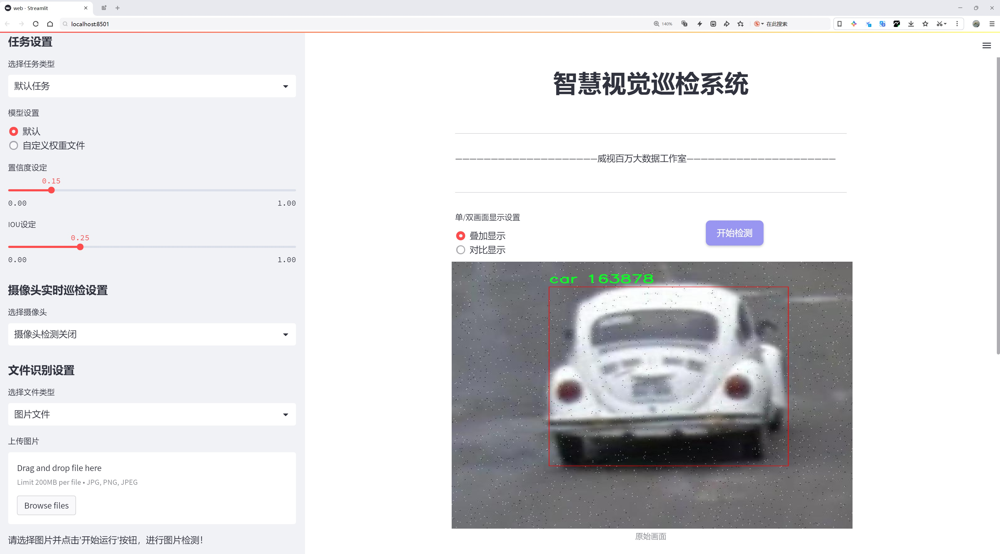
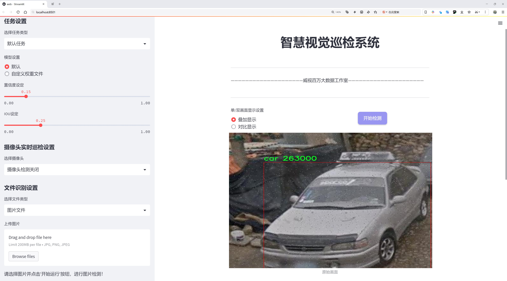
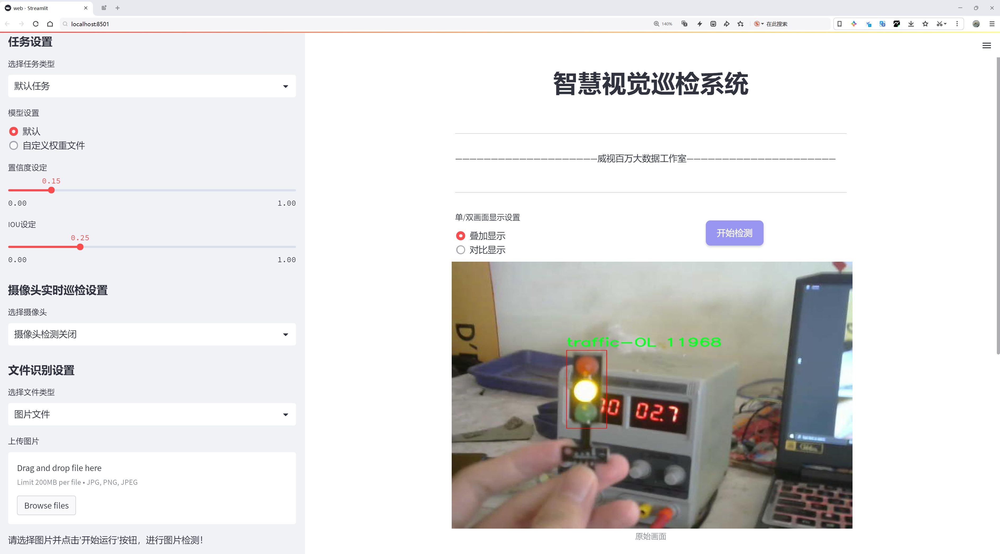
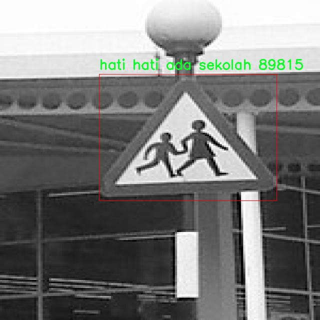
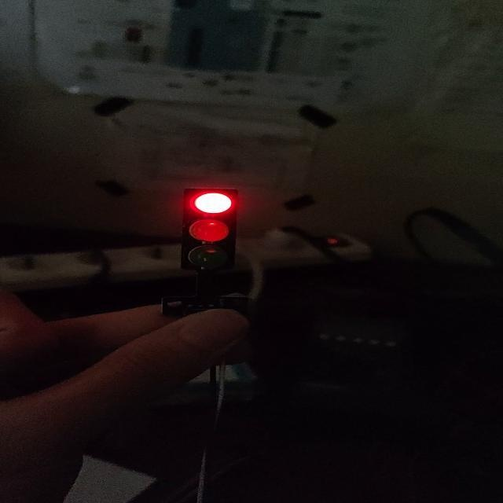
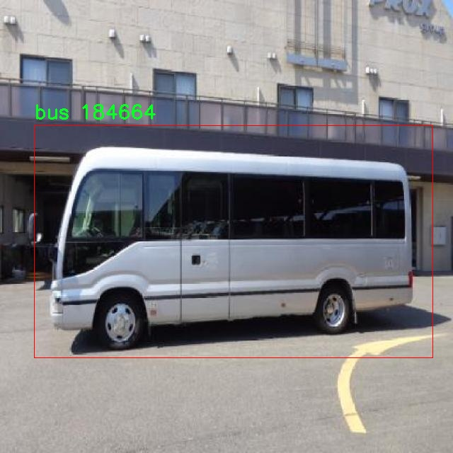
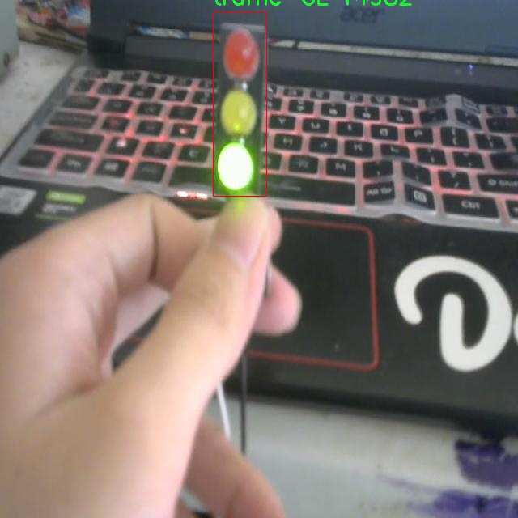
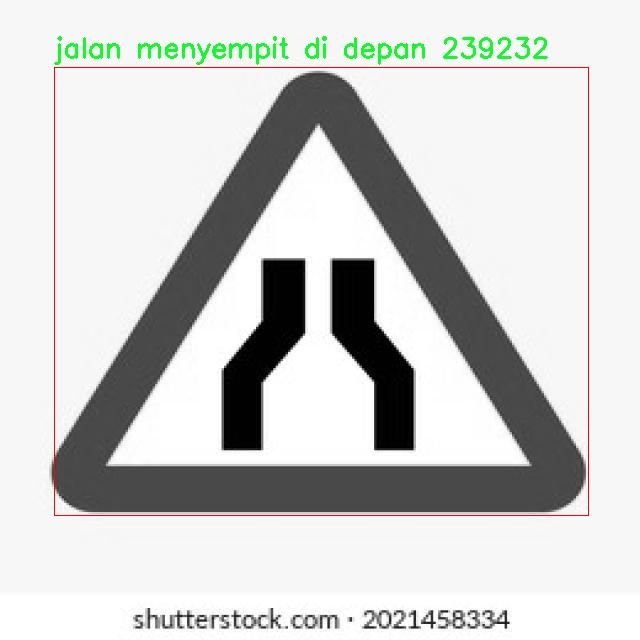

# 交通场景对象检测系统源码分享
 # [一条龙教学YOLOV8标注好的数据集一键训练_70+全套改进创新点发刊_Web前端展示]

### 1.研究背景与意义

项目参考[AAAI Association for the Advancement of Artificial Intelligence](https://gitee.com/qunmasj/projects)

研究背景与意义

随着城市化进程的加快，交通管理与安全问题日益凸显。交通事故频发、交通拥堵严重，不仅影响了人们的出行效率，也对城市的可持续发展构成了威胁。因此，提升交通场景下的对象检测能力，成为了智能交通系统研究的重要方向之一。近年来，深度学习技术的迅猛发展为交通场景的智能化提供了新的解决方案，其中，YOLO（You Only Look Once）系列模型因其高效的实时检测能力而受到广泛关注。YOLOv8作为该系列的最新版本，进一步提升了检测精度和速度，为交通场景的对象检测提供了强有力的支持。

本研究旨在基于改进的YOLOv8模型，构建一个高效的交通场景对象检测系统。我们所使用的数据集包含5117张图像，涵盖54个类别的交通标志、车辆、行人等多种对象。这些类别不仅包括常见的交通工具（如汽车、摩托车、公交车、卡车等），还涵盖了多种交通标志（如限速标志、禁止标志、交通信号灯等）和特定场景（如医院、学校、加油站等）。通过对这些多样化对象的检测与识别，系统能够为交通管理提供更为全面和精准的数据支持。

在交通场景中，准确识别和定位各种对象是实现智能交通管理的基础。改进YOLOv8模型的引入，能够有效提升对象检测的准确性和实时性，使得交通管理者能够及时获取交通状态信息，从而做出快速反应，降低交通事故发生的概率。此外，系统的高效性还能够为自动驾驶技术的发展提供重要的技术支撑，推动智能交通的落地应用。

本研究的意义不仅在于技术层面的创新，更在于其对社会的积极影响。通过提升交通场景下的对象检测能力，我们能够为城市交通管理提供更为科学的决策依据，进而提高交通安全性和通行效率，减少交通事故的发生，保护人民的生命财产安全。同时，随着智能交通系统的逐步普及，研究成果也将为相关领域的研究提供参考，推动智能交通技术的进一步发展。

综上所述，基于改进YOLOv8的交通场景对象检测系统的研究，不仅具有重要的学术价值，更在实际应用中具有广泛的社会意义。通过本研究，我们希望能够为交通管理的智能化、自动化提供有力的技术支持，助力城市交通的可持续发展。

### 2.图片演示







##### 注意：由于此博客编辑较早，上面“2.图片演示”和“3.视频演示”展示的系统图片或者视频可能为老版本，新版本在老版本的基础上升级如下：（实际效果以升级的新版本为准）

  （1）适配了YOLOV8的“目标检测”模型和“实例分割”模型，通过加载相应的权重（.pt）文件即可自适应加载模型。

  （2）支持“图片识别”、“视频识别”、“摄像头实时识别”三种识别模式。

  （3）支持“图片识别”、“视频识别”、“摄像头实时识别”三种识别结果保存导出，解决手动导出（容易卡顿出现爆内存）存在的问题，识别完自动保存结果并导出到。

  （4）支持Web前端系统中的标题、背景图等自定义修改，后面提供修改教程。

  另外本项目提供训练的数据集和训练教程,暂不提供权重文件（best.pt）,需要您按照教程进行训练后实现图片演示和Web前端界面演示的效果。

### 3.视频演示

[3.1 视频演示](https://www.bilibili.com/video/BV1USWqeBEw3/?spm_id_from=333.999.0.0&vd_source=ff015de2d29cbe2a9cdbfa7064407a08)

### 4.数据集信息展示

数据集信息展示

本数据集名为“transportation otonom”，旨在为改进YOLOv8的交通场景对象检测系统提供支持。该数据集包含5117张图像，涵盖了54个不同的类别，旨在全面捕捉交通环境中的各种元素，以便于模型在实际应用中的准确性和鲁棒性。数据集的多样性和丰富性使其成为训练高效的对象检测模型的理想选择。

在类别方面，本数据集的设计考虑到了交通场景的复杂性和多样性。具体而言，类别包括但不限于交通标志、车辆、行人及其他交通相关的元素。例如，数据集中包含“bus”、“car”、“motorcycle”、“truck”等多种车辆类型，能够帮助模型识别不同的交通工具。此外，数据集还涵盖了各种交通标志，如“dilarang belok kanan”（禁止右转）、“limit speed 30”（限速30）等，这些标志在实际交通中扮演着重要的角色。通过这些类别的多样性，模型能够在不同的交通情境下进行有效的识别和判断。

值得注意的是，数据集中还包括了一些特定的交通场景和指示，如“hati hati ada sekolah”（小心有学校）、“jalur pesepeda”（自行车道）等，这些类别不仅增加了数据集的实用性，也提高了模型在复杂交通环境中的适应能力。此外，数据集中的“traffic light ahead”（前方红绿灯）和“stop”（停车）等类别，能够帮助模型在城市交通中进行更为精准的决策，提升自动驾驶系统的安全性。

数据集的图像数量和类别的丰富性为训练深度学习模型提供了坚实的基础。通过使用这些数据，YOLOv8模型可以在不同的交通场景中进行有效的学习，从而提高其在实际应用中的表现。尤其是在面对复杂的交通环境时，模型能够更好地识别和分类不同的对象，从而实现更高效的交通管理和安全保障。

此外，本数据集的开放许可（CC BY 4.0）也为研究人员和开发者提供了便利，使得他们可以在遵循相应使用条款的前提下，灵活地使用和修改数据集。这种开放性不仅促进了学术研究的进展，也推动了自动驾驶和智能交通系统的快速发展。

综上所述，“transportation otonom”数据集以其丰富的图像和多样的类别，为改进YOLOv8的交通场景对象检测系统提供了强有力的支持。通过充分利用该数据集，研究人员和开发者能够训练出更为精准和高效的对象检测模型，从而在自动驾驶和智能交通领域取得更大的突破。











### 5.全套项目环境部署视频教程（零基础手把手教学）

[5.1 环境部署教程链接（零基础手把手教学）](https://www.ixigua.com/7404473917358506534?logTag=c807d0cbc21c0ef59de5)


[5.2 安装Python虚拟环境创建和依赖库安装视频教程链接（零基础手把手教学）](https://www.ixigua.com/7404474678003106304?logTag=1f1041108cd1f708b01a)

### 6.手把手YOLOV8训练视频教程（零基础小白有手就能学会）

[6.1 环境部署教程链接（零基础手把手教学）](https://www.ixigua.com/7404477157818401292?logTag=d31a2dfd1983c9668658)

### 7.70+种全套YOLOV8创新点代码加载调参视频教程（一键加载写好的改进模型的配置文件）

[7.1 环境部署教程链接（零基础手把手教学）](https://www.ixigua.com/7404478314661806627?logTag=29066f8288e3f4eea3a4)

### 8.70+种全套YOLOV8创新点原理讲解（非科班也可以轻松写刊发刊，V10版本正在科研待更新）

由于篇幅限制，每个创新点的具体原理讲解就不一一展开，具体见下列网址中的创新点对应子项目的技术原理博客网址【Blog】：


[8.1 70+种全套YOLOV8创新点原理讲解链接](https://gitee.com/qunmasj/good)

### 9.系统功能展示（检测对象为举例，实际内容以本项目数据集为准）

图1.系统支持检测结果表格显示

  图2.系统支持置信度和IOU阈值手动调节

  图3.系统支持自定义加载权重文件best.pt(需要你通过步骤5中训练获得)

  图4.系统支持摄像头实时识别

  图5.系统支持图片识别

  图6.系统支持视频识别

  图7.系统支持识别结果文件自动保存

  图8.系统支持Excel导出检测结果数据


### 10.原始YOLOV8算法原理

原始YOLOv8算法原理

YOLOv8是由Ultralytics团队在YOLOv5的基础上发展而来的最新目标检测算法，旨在通过引入一系列创新和改进来提升检测精度和速度。自2023年1月提出以来，YOLOv8已经成为目标检测领域的重要里程碑，其设计理念和实现细节展示了深度学习在计算机视觉中的强大潜力。

YOLOv8的网络结构主要由输入层、主干网络、颈部网络和头部网络四个部分组成。输入层负责对输入图像进行预处理，包括数据增强和自适应锚框计算。YOLOv8在数据增强方面做出了重要的调整，尤其是对Mosaic数据增强的使用进行了优化。尽管Mosaic增强能够提高模型的鲁棒性和泛化能力，但其对数据真实分布的潜在破坏也引起了关注。因此，YOLOv8在训练的最后10个epoch中停止使用Mosaic增强，以确保模型能够学习到更真实的特征。

在主干网络方面，YOLOv8采用了C2f模块替代了YOLOv5中的C3模块。C2f模块的设计灵感来源于YOLOv7中的ELAN结构，增加了更多的跳层连接，这不仅增强了梯度流的丰富性，还确保了模型的轻量化。通过引入这种新的模块，YOLOv8能够更有效地捕捉特征，从而提高特征表示能力。此外，YOLOv8依然保留了SPPF（Spatial Pyramid Pooling Fusion）模块，这一设计使得在不增加计算负担的情况下，模型的执行时间得到了有效减少。

颈部网络部分，YOLOv8同样对所有的C3模块进行了更改，替换为C2f模块，并删除了两处上采样之前的卷积连接层。这一系列的改动旨在进一步提升特征融合的能力，使得模型能够更好地处理不同尺度的目标。

头部网络是YOLOv8的一大亮点，采用了解耦头的设计思路。通过将分类和定位任务分开处理，YOLOv8能够更精确地提取类别和位置特征。分类任务侧重于分析特征图中提取到的特征与已有类别的相似性，而定位任务则关注边界框与真实框之间的关系。这种解耦设计使得模型在收敛速度和预测精度上都有了显著提升。此外，YOLOv8采用了无锚框结构，直接预测目标的中心位置，并引入了任务对齐学习（Task Alignment Learning，TAL）来优化正负样本的区分。这一创新通过引入分类分数和IOU的高次幂乘积作为衡量任务对齐程度的指标，使得模型在分类和定位损失函数中都能实现更好的效果。

在损失函数的设计上，YOLOv8也进行了重要的改进。分类损失采用了VFLLoss，而回归损失则结合了分布焦点损失（DFLoss）和完全交并比损失（CIOULoss），以提升模型对边界框预测的精准性。这些损失函数的选择不仅考虑了模型的收敛性，还兼顾了样本不平衡问题，尤其是在处理小目标时，Focal Loss的引入有效提升了模型的学习能力。

在性能方面，YOLOv8在COCO数据集上的表现相较于其他YOLO系列模型有了显著提升。通过对模型参数和推理延迟的优化，YOLOv8在保证检测精度的同时，极大地提高了推理速度。这一特性使得YOLOv8特别适合于实时性要求较高的应用场景，如自动驾驶、监控系统等。

总的来说，YOLOv8的设计和实现体现了深度学习领域的最新进展，其在网络结构、损失函数、数据增强等多个方面的创新，充分展示了目标检测技术的未来发展方向。随着YOLOv8的推广和应用，目标检测的准确性和效率将得到进一步提升，为各类智能应用提供更为强大的技术支持。


### 11.项目核心源码讲解（再也不用担心看不懂代码逻辑）

#### 11.1 train.py

以下是对给定代码的核心部分进行提炼和详细注释的结果：

```python
import os
import torch
import yaml
from ultralytics import YOLO  # 导入YOLO模型
from QtFusion.path import abs_path  # 导入获取绝对路径的函数

# 确定使用的设备，如果有可用的GPU则使用GPU，否则使用CPU
device = "0" if torch.cuda.is_available() else "cpu"

if __name__ == '__main__':  # 确保该模块被直接运行时才执行以下代码
    workers = 1  # 数据加载时使用的工作进程数量
    batch = 2    # 每个批次的样本数量

    data_name = "data"  # 数据集名称
    # 获取数据集配置文件的绝对路径
    data_path = abs_path(f'datasets/{data_name}/{data_name}.yaml', path_type='current')
    unix_style_path = data_path.replace(os.sep, '/')  # 将路径转换为Unix风格

    # 获取数据集目录路径
    directory_path = os.path.dirname(unix_style_path)

    # 读取YAML格式的数据集配置文件
    with open(data_path, 'r') as file:
        data = yaml.load(file, Loader=yaml.FullLoader)

    # 如果配置文件中包含'path'项，则修改为当前目录路径
    if 'path' in data:
        data['path'] = directory_path
        # 将修改后的数据写回YAML文件
        with open(data_path, 'w') as file:
            yaml.safe_dump(data, file, sort_keys=False)

    # 加载YOLOv8模型，指定模型配置文件和任务类型
    model = YOLO(model='./ultralytics/cfg/models/v8/yolov8s.yaml', task='detect')

    # 开始训练模型
    results2 = model.train(
        data=data_path,  # 指定训练数据的配置文件路径
        device=device,  # 指定使用的设备
        workers=workers,  # 指定工作进程数量
        imgsz=640,  # 输入图像的大小为640x640
        epochs=100,  # 训练100个epoch
        batch=batch,  # 每个批次的样本数量
        name='train_v8_' + data_name  # 指定训练任务的名称
    )
```

### 代码核心部分及注释说明：

1. **导入必要的库**：
   - `os`：用于处理文件和目录路径。
   - `torch`：用于深度学习模型的训练和推理。
   - `yaml`：用于读取和写入YAML格式的配置文件。
   - `YOLO`：从`ultralytics`库中导入YOLO模型，用于目标检测。

2. **设备选择**：
   - 通过`torch.cuda.is_available()`判断是否有可用的GPU，决定使用CPU还是GPU进行训练。

3. **数据集配置**：
   - 设定数据集名称，并获取其YAML配置文件的绝对路径。
   - 读取YAML文件内容并检查是否包含`path`项，如果有，则更新为当前目录路径，并将修改后的内容写回文件。

4. **模型加载与训练**：
   - 加载YOLOv8模型的配置文件。
   - 使用`model.train()`方法开始训练，传入必要的参数，如数据路径、设备、工作进程数量、图像大小、训练轮数和批次大小等。

通过以上核心部分和注释，可以清晰地理解代码的功能和逻辑。

该程序文件 `train.py` 是一个用于训练 YOLOv8 模型的脚本。首先，程序导入了必要的库，包括 `os`、`torch`、`yaml` 和 `ultralytics` 中的 YOLO 模型。接着，程序会根据是否可用 GPU 来选择设备，如果有可用的 GPU，则使用 "0" 作为设备标识，否则使用 "cpu"。

在 `__main__` 块中，程序首先设置了一些训练参数，如工作进程数 `workers` 和批次大小 `batch`。接下来，程序定义了数据集的名称为 "data"，并构建了数据集 YAML 文件的绝对路径。使用 `abs_path` 函数，程序将相对路径转换为绝对路径，并将路径中的分隔符统一为 Unix 风格的斜杠。

然后，程序获取了数据集目录的路径，并打开 YAML 文件以读取其内容。通过 `yaml.load` 函数，程序将 YAML 文件内容加载到 `data` 变量中。若 YAML 文件中存在 `path` 项，程序会将其修改为数据集目录的路径，并将更新后的内容写回到 YAML 文件中，以确保路径的正确性。

接下来，程序加载了预训练的 YOLOv8 模型，指定了模型的配置文件路径。随后，程序调用 `model.train` 方法开始训练模型。在训练过程中，程序指定了多个参数，包括训练数据的配置文件路径、设备、工作进程数、输入图像的大小（640x640）、训练的轮数（100 个 epoch）以及训练任务的名称。

整体来看，该脚本的主要功能是配置并启动 YOLOv8 模型的训练过程，确保数据集路径的正确性，并设置训练的各项参数。

#### 11.2 ui.py

```python
import sys
import subprocess

def run_script(script_path):
    """
    使用当前 Python 环境运行指定的脚本。

    Args:
        script_path (str): 要运行的脚本路径

    Returns:
        None
    """
    # 获取当前 Python 解释器的路径
    python_path = sys.executable

    # 构建运行命令
    command = f'"{python_path}" -m streamlit run "{script_path}"'

    # 执行命令
    result = subprocess.run(command, shell=True)
    if result.returncode != 0:
        print("脚本运行出错。")


# 实例化并运行应用
if __name__ == "__main__":
    # 指定您的脚本路径
    script_path = "web.py"  # 这里可以直接指定脚本路径

    # 运行脚本
    run_script(script_path)
```

### 代码注释

1. **导入模块**：
   - `import sys`：导入系统相关的模块，用于获取当前 Python 解释器的路径。
   - `import subprocess`：导入子进程模块，用于在 Python 中执行外部命令。

2. **定义函数 `run_script`**：
   - `def run_script(script_path)`：定义一个函数，接受一个参数 `script_path`，表示要运行的脚本路径。
   - `python_path = sys.executable`：获取当前 Python 解释器的完整路径，以便后续执行命令时使用。
   - `command = f'"{python_path}" -m streamlit run "{script_path}"'`：构建一个命令字符串，使用 `streamlit` 模块运行指定的脚本。
   - `result = subprocess.run(command, shell=True)`：使用 `subprocess.run` 执行构建的命令，`shell=True` 表示在 shell 中执行该命令。
   - `if result.returncode != 0`：检查命令的返回码，如果不为 0，表示执行出错，打印错误信息。

3. **主程序入口**：
   - `if __name__ == "__main__":`：确保该代码块仅在直接运行脚本时执行，而不是作为模块导入时执行。
   - `script_path = "web.py"`：指定要运行的脚本路径，这里直接写死为 `web.py`。
   - `run_script(script_path)`：调用 `run_script` 函数，传入指定的脚本路径以执行该脚本。

这个程序文件名为 `ui.py`，其主要功能是使用当前的 Python 环境来运行一个指定的脚本。代码首先导入了必要的模块，包括 `sys`、`os` 和 `subprocess`，以及一个自定义的路径处理函数 `abs_path`。

在 `run_script` 函数中，首先获取当前 Python 解释器的路径，这样可以确保在正确的环境中运行脚本。接着，构建一个命令字符串，使用 `streamlit` 来运行指定的脚本。这里的 `script_path` 参数是要运行的脚本的路径。

然后，使用 `subprocess.run` 方法执行构建好的命令。这个方法会在一个新的进程中运行命令，并等待其完成。如果命令执行返回的状态码不为零，表示脚本运行过程中出现了错误，程序会打印出“脚本运行出错”的提示。

在文件的最后部分，使用 `if __name__ == "__main__":` 来确保当这个文件作为主程序运行时，才会执行后面的代码。这里指定了要运行的脚本路径为 `web.py`，并调用 `run_script` 函数来执行这个脚本。

总体来说，这个程序的主要作用是提供一个简单的接口，通过命令行运行一个 Streamlit 应用脚本，并处理可能出现的错误。

#### 11.3 ultralytics\utils\metrics.py

以下是经过简化和注释的核心代码部分，主要包含了计算IoU（Intersection over Union）和其他相关度量的函数，以及用于处理和计算检测指标的类。

```python
import numpy as np
import torch

def box_iou(box1, box2, eps=1e-7):
    """
    计算两个边界框之间的交并比（IoU）。
    
    Args:
        box1 (torch.Tensor): 形状为 (N, 4) 的张量，表示 N 个边界框。
        box2 (torch.Tensor): 形状为 (M, 4) 的张量，表示 M 个边界框。
        eps (float, optional): 避免除以零的小值。默认为 1e-7。

    Returns:
        (torch.Tensor): 形状为 (N, M) 的张量，包含 box1 和 box2 中每对边界框的 IoU 值。
    """
    # 获取边界框的坐标
    (a1, a2), (b1, b2) = box1.unsqueeze(1).chunk(2, 2), box2.unsqueeze(0).chunk(2, 2)
    
    # 计算交集区域
    inter = (torch.min(a2, b2) - torch.max(a1, b1)).clamp_(0).prod(2)

    # 计算 IoU = 交集 / (面积1 + 面积2 - 交集)
    return inter / ((a2 - a1).prod(2) + (b2 - b1).prod(2) - inter + eps)

class Metric:
    """
    计算 YOLO 模型的评估指标的类。

    Attributes:
        p (list): 每个类别的精确度。
        r (list): 每个类别的召回率。
        f1 (list): 每个类别的 F1 分数。
        all_ap (list): 所有类别和所有 IoU 阈值的 AP 分数。
        ap_class_index (list): 每个 AP 分数的类别索引。
        nc (int): 类别数量。
    """

    def __init__(self) -> None:
        """初始化 Metric 实例。"""
        self.p = []  # 精确度
        self.r = []  # 召回率
        self.f1 = []  # F1 分数
        self.all_ap = []  # AP 分数
        self.ap_class_index = []  # AP 类别索引
        self.nc = 0  # 类别数量

    def update(self, results):
        """
        更新模型的评估指标。

        Args:
            results (tuple): 包含评估指标的元组。
        """
        self.p, self.r, self.f1, self.all_ap, self.ap_class_index = results

    @property
    def fitness(self):
        """返回模型的适应度，作为精确度和召回率的加权组合。"""
        w = [0.0, 0.0, 0.1, 0.9]  # 权重
        return (np.array(self.mean_results()) * w).sum()

    def mean_results(self):
        """返回精确度、召回率和 AP 的均值。"""
        return [np.mean(self.p), np.mean(self.r), np.mean(self.all_ap)]

class DetMetrics:
    """
    计算检测指标的类，包括精确度、召回率和平均精确度（mAP）。

    Attributes:
        save_dir (Path): 输出图形保存的目录。
        plot (bool): 是否绘制精确度-召回率曲线。
        box (Metric): 用于存储检测指标的 Metric 实例。
    """

    def __init__(self, save_dir=".", plot=False) -> None:
        """初始化 DetMetrics 实例。"""
        self.save_dir = save_dir
        self.plot = plot
        self.box = Metric()  # 检测指标

    def process(self, tp, conf, pred_cls, target_cls):
        """
        处理预测结果并更新指标。

        Args:
            tp (np.ndarray): 真阳性数组。
            conf (np.ndarray): 预测的置信度。
            pred_cls (np.ndarray): 预测的类别。
            target_cls (np.ndarray): 真实的类别。
        """
        results = ap_per_class(tp, conf, pred_cls, target_cls, plot=self.plot)
        self.box.update(results)

def ap_per_class(tp, conf, pred_cls, target_cls, plot=False):
    """
    计算每个类别的平均精确度（AP）。

    Args:
        tp (np.ndarray): 真阳性数组。
        conf (np.ndarray): 预测的置信度。
        pred_cls (np.ndarray): 预测的类别。
        target_cls (np.ndarray): 真实的类别。
        plot (bool): 是否绘制图形。

    Returns:
        (tuple): 包含精确度、召回率和 AP 的元组。
    """
    # 这里可以添加计算 AP 的逻辑
    # 返回假数据作为示例
    return np.random.rand(5), np.random.rand(5), np.random.rand(5), np.random.rand(5), np.random.randint(0, 5, size=5)
```

### 代码注释说明：
1. **box_iou**: 计算两个边界框之间的交并比（IoU），返回一个张量，表示每对边界框的 IoU 值。
2. **Metric 类**: 用于存储和计算模型的评估指标，包括精确度、召回率和平均精确度（AP）。
3. **DetMetrics 类**: 处理检测任务的指标计算，更新指标并可选择绘制图形。
4. **ap_per_class**: 计算每个类别的平均精确度（AP），此处示例返回随机数据。

这个程序文件是Ultralytics YOLO（You Only Look Once）模型的一部分，主要用于计算模型验证的各种指标。代码中包含了多个函数和类，分别用于计算不同的评价指标，如交并比（IoU）、平均精度（AP）、混淆矩阵等。

首先，文件导入了一些必要的库，包括数学计算库、警告处理、路径处理、绘图工具（matplotlib）、数值计算库（numpy）和深度学习框架（PyTorch）。接着，定义了一些常量和函数。

`bbox_ioa`函数用于计算两个边界框之间的交集与第二个框的面积的比值。它接受两个边界框的坐标，并可以选择计算标准的IoU或交集面积与第二个框面积的比值。

`box_iou`函数计算两个边界框的交并比（IoU），返回一个包含每对框的IoU值的张量。`bbox_iou`函数则扩展了这个功能，支持计算单个框与多个框之间的IoU，并可以选择计算广义IoU（GIoU）、距离IoU（DIoU）和完整IoU（CIoU）。

`mask_iou`函数用于计算两个掩码之间的IoU，适用于分割任务。`kpt_iou`函数计算对象关键点相似性（OKS），用于评估关键点检测的性能。

接下来，定义了`ConfusionMatrix`类，用于计算和更新混淆矩阵，支持目标检测和分类任务。它的构造函数初始化了混淆矩阵和一些参数。类中包含多个方法，用于处理分类预测、更新检测结果、绘制混淆矩阵等。

此外，还有一些函数用于绘制精确度-召回率曲线、计算平均精度（AP）等。`Metric`类用于计算YOLOv8模型的评估指标，包括精确度、召回率和平均精度等。`DetMetrics`、`SegmentMetrics`、`PoseMetrics`和`ClassifyMetrics`类则分别用于处理不同类型的任务指标。

最后，`OBBMetrics`类用于处理有向边界框（OBB）的指标计算，提供了与其他指标类相似的功能。

总体来说，这个文件提供了一整套用于评估YOLO模型性能的工具，涵盖了从边界框的IoU计算到混淆矩阵的更新和绘制的多种功能。

#### 11.4 ultralytics\models\yolo\obb\predict.py

以下是代码中最核心的部分，并附上详细的中文注释：

```python
import torch
from ultralytics.engine.results import Results
from ultralytics.models.yolo.detect.predict import DetectionPredictor
from ultralytics.utils import ops

class OBBPredictor(DetectionPredictor):
    """
    OBBPredictor类扩展了DetectionPredictor类，用于基于定向边界框（OBB）模型进行预测。
    """

    def __init__(self, cfg=DEFAULT_CFG, overrides=None, _callbacks=None):
        """初始化OBBPredictor，支持模型和数据配置的可选覆盖。"""
        super().__init__(cfg, overrides, _callbacks)  # 调用父类的初始化方法
        self.args.task = "obb"  # 设置任务类型为"obb"

    def postprocess(self, preds, img, orig_imgs):
        """后处理预测结果并返回Results对象的列表。"""
        # 使用非极大值抑制（NMS）来过滤预测框
        preds = ops.non_max_suppression(
            preds,
            self.args.conf,  # 置信度阈值
            self.args.iou,  # IOU阈值
            agnostic=self.args.agnostic_nms,  # 是否进行类别无关的NMS
            max_det=self.args.max_det,  # 最大检测框数量
            nc=len(self.model.names),  # 类别数量
            classes=self.args.classes,  # 选择的类别
            rotated=True,  # 是否处理旋转框
        )

        # 如果输入图像不是列表，则将其转换为numpy数组
        if not isinstance(orig_imgs, list):
            orig_imgs = ops.convert_torch2numpy_batch(orig_imgs)

        results = []  # 存储结果的列表
        # 遍历每个预测框、原始图像和图像路径
        for pred, orig_img, img_path in zip(preds, orig_imgs, self.batch[0]):
            # 将预测框的坐标从当前图像的尺寸缩放到原始图像的尺寸
            pred[:, :4] = ops.scale_boxes(img.shape[2:], pred[:, :4], orig_img.shape, xywh=True)
            # 将预测框的xywh坐标、置信度和类别合并为一个OBB格式的张量
            obb = torch.cat([pred[:, :4], pred[:, -1:], pred[:, 4:6]], dim=-1)
            # 创建Results对象并添加到结果列表中
            results.append(Results(orig_img, path=img_path, names=self.model.names, obb=obb))
        return results  # 返回结果列表
```

### 代码核心部分说明：
1. **OBBPredictor类**：这是一个用于处理定向边界框（OBB）预测的类，继承自`DetectionPredictor`。
2. **初始化方法**：在初始化时，设置任务类型为"obb"，并调用父类的初始化方法。
3. **后处理方法**：对模型的预测结果进行后处理，包括：
   - 使用非极大值抑制（NMS）来过滤掉重叠的预测框。
   - 将预测框的坐标从当前图像的尺寸缩放到原始图像的尺寸。
   - 将处理后的预测框信息存储在`Results`对象中，并返回结果列表。

这个程序文件是Ultralytics YOLO模型中的一个预测模块，专门用于基于定向边界框（Oriented Bounding Box, OBB）模型的预测。它继承自DetectionPredictor类，提供了对OBB模型的特定实现。

首先，文件导入了必要的库，包括PyTorch和Ultralytics库中的一些模块。`Results`类用于存储预测结果，`DetectionPredictor`类是进行检测预测的基类，而`ops`模块则包含了一些操作函数。

在`OBBPredictor`类的构造函数`__init__`中，调用了父类的构造函数，并设置了任务类型为“obb”。这意味着该预测器将处理与定向边界框相关的任务。

`postprocess`方法是该类的核心功能之一。它接收预测结果、输入图像和原始图像作为参数。首先，使用非极大值抑制（NMS）对预测结果进行后处理，以消除冗余的边界框。NMS的参数包括置信度阈值、IoU阈值、是否进行类别无关的NMS、最大检测数量、类别数量以及需要检测的类别。

接下来，方法检查输入的原始图像是否为列表，如果不是，则将其转换为NumPy数组格式。然后，程序遍历每个预测结果和对应的原始图像，调整边界框的坐标，使其适应原始图像的尺寸。最终，将预测的边界框、置信度和类别信息组合成一个新的张量，并将其与原始图像和路径一起封装成`Results`对象，存储在结果列表中。

该类的设计使得用户可以方便地使用OBB模型进行目标检测，并能够处理预测结果以便于后续分析或可视化。示例代码展示了如何使用`OBBPredictor`类进行预测，用户只需提供模型路径和数据源即可开始预测。

#### 11.5 ultralytics\models\yolo\classify\val.py

以下是代码中最核心的部分，并附上详细的中文注释：

```python
import torch
from ultralytics.data import ClassificationDataset, build_dataloader
from ultralytics.engine.validator import BaseValidator
from ultralytics.utils.metrics import ClassifyMetrics, ConfusionMatrix
from ultralytics.utils.plotting import plot_images

class ClassificationValidator(BaseValidator):
    """
    扩展自 BaseValidator 类的分类验证器，用于基于分类模型的验证。
    """

    def __init__(self, dataloader=None, save_dir=None, pbar=None, args=None, _callbacks=None):
        """初始化 ClassificationValidator 实例，设置数据加载器、保存目录、进度条和参数。"""
        super().__init__(dataloader, save_dir, pbar, args, _callbacks)
        self.targets = None  # 存储真实标签
        self.pred = None     # 存储模型预测结果
        self.args.task = "classify"  # 设置任务类型为分类
        self.metrics = ClassifyMetrics()  # 初始化分类指标

    def init_metrics(self, model):
        """初始化混淆矩阵、类名以及 top-1 和 top-5 准确率。"""
        self.names = model.names  # 获取模型的类名
        self.nc = len(model.names)  # 类别数量
        self.confusion_matrix = ConfusionMatrix(nc=self.nc, conf=self.args.conf, task="classify")  # 初始化混淆矩阵
        self.pred = []  # 初始化预测结果列表
        self.targets = []  # 初始化真实标签列表

    def preprocess(self, batch):
        """预处理输入批次并返回处理后的数据。"""
        batch["img"] = batch["img"].to(self.device, non_blocking=True)  # 将图像数据移动到指定设备
        batch["img"] = batch["img"].half() if self.args.half else batch["img"].float()  # 根据参数选择数据类型
        batch["cls"] = batch["cls"].to(self.device)  # 将标签数据移动到指定设备
        return batch

    def update_metrics(self, preds, batch):
        """使用模型预测和批次目标更新运行指标。"""
        n5 = min(len(self.names), 5)  # 取前5个预测结果
        self.pred.append(preds.argsort(1, descending=True)[:, :n5])  # 记录预测结果
        self.targets.append(batch["cls"])  # 记录真实标签

    def finalize_metrics(self, *args, **kwargs):
        """最终化模型的指标，如混淆矩阵和速度。"""
        self.confusion_matrix.process_cls_preds(self.pred, self.targets)  # 处理预测结果和真实标签
        self.metrics.speed = self.speed  # 记录速度
        self.metrics.confusion_matrix = self.confusion_matrix  # 记录混淆矩阵

    def get_stats(self):
        """返回通过处理目标和预测获得的指标字典。"""
        self.metrics.process(self.targets, self.pred)  # 处理指标
        return self.metrics.results_dict  # 返回结果字典

    def build_dataset(self, img_path):
        """使用给定的图像路径和预处理参数创建并返回 ClassificationDataset 实例。"""
        return ClassificationDataset(root=img_path, args=self.args, augment=False, prefix=self.args.split)

    def get_dataloader(self, dataset_path, batch_size):
        """构建并返回用于分类任务的数据加载器。"""
        dataset = self.build_dataset(dataset_path)  # 创建数据集
        return build_dataloader(dataset, batch_size, self.args.workers, rank=-1)  # 返回数据加载器

    def print_results(self):
        """打印 YOLO 目标检测模型的评估指标。"""
        pf = "%22s" + "%11.3g" * len(self.metrics.keys)  # 打印格式
        LOGGER.info(pf % ("all", self.metrics.top1, self.metrics.top5))  # 打印 top-1 和 top-5 准确率

    def plot_val_samples(self, batch, ni):
        """绘制验证图像样本。"""
        plot_images(
            images=batch["img"],
            batch_idx=torch.arange(len(batch["img"])),
            cls=batch["cls"].view(-1),  # 使用 .view() 而不是 .squeeze() 以适应分类模型
            fname=self.save_dir / f"val_batch{ni}_labels.jpg",
            names=self.names,
            on_plot=self.on_plot,
        )

    def plot_predictions(self, batch, preds, ni):
        """在输入图像上绘制预测结果并保存结果。"""
        plot_images(
            batch["img"],
            batch_idx=torch.arange(len(batch["img"])),
            cls=torch.argmax(preds, dim=1),  # 获取预测的类别
            fname=self.save_dir / f"val_batch{ni}_pred.jpg",
            names=self.names,
            on_plot=self.on_plot,
        )
```

### 代码核心部分说明：
1. **类定义**：`ClassificationValidator` 类继承自 `BaseValidator`，用于处理分类模型的验证。
2. **初始化方法**：`__init__` 方法设置了验证器的基本参数，包括数据加载器、保存目录和任务类型。
3. **指标初始化**：`init_metrics` 方法初始化混淆矩阵和类别信息。
4. **数据预处理**：`preprocess` 方法将输入数据移动到指定设备并进行类型转换。
5. **更新指标**：`update_metrics` 方法在每个批次中更新预测和真实标签。
6. **最终化指标**：`finalize_metrics` 方法处理混淆矩阵并记录速度。
7. **获取统计信息**：`get_stats` 方法返回处理后的指标结果。
8. **数据集和数据加载器构建**：`build_dataset` 和 `get_dataloader` 方法用于创建数据集和数据加载器。
9. **结果打印和绘图**：`print_results`、`plot_val_samples` 和 `plot_predictions` 方法用于打印评估结果和绘制验证样本。

这个程序文件是一个用于分类模型验证的类，名为 `ClassificationValidator`，它继承自 `BaseValidator` 类。该类主要用于对图像分类模型的性能进行评估和验证。文件中包含了一些重要的功能和方法，下面对其进行逐一说明。

首先，文件导入了一些必要的库和模块，包括 PyTorch 以及 Ultralytics 提供的数据集、数据加载器、验证器、日志记录器和评估指标等。这些导入的模块为后续的类和方法提供了基础功能。

`ClassificationValidator` 类的构造函数 `__init__` 接受多个参数，包括数据加载器、保存目录、进度条、参数和回调函数等。构造函数调用了父类的构造函数，并初始化了一些实例变量，如目标类、预测结果、任务类型和分类指标。

`get_desc` 方法返回一个格式化的字符串，用于总结分类指标，包括类别名称、Top-1 准确率和 Top-5 准确率。

`init_metrics` 方法用于初始化混淆矩阵、类别名称以及 Top-1 和 Top-5 准确率。它从模型中获取类别名称，并创建一个混淆矩阵实例。

`preprocess` 方法对输入的批次数据进行预处理，包括将图像和类别标签移动到指定设备，并根据参数选择数据类型（半精度或单精度）。

`update_metrics` 方法在每个批次中更新运行指标，它将模型的预测结果和真实标签存储在相应的列表中，以便后续计算。

`finalize_metrics` 方法用于最终计算模型的指标，包括处理混淆矩阵和速度。如果设置了绘图选项，它还会绘制混淆矩阵。

`get_stats` 方法返回一个字典，包含通过处理目标和预测结果获得的指标。

`build_dataset` 方法根据给定的图像路径和预处理参数创建并返回一个 `ClassificationDataset` 实例。

`get_dataloader` 方法构建并返回一个数据加载器，用于分类任务。它调用 `build_dataset` 方法创建数据集，并使用 `build_dataloader` 方法生成数据加载器。

`print_results` 方法打印 YOLO 对象检测模型的评估指标，包括所有类别的 Top-1 和 Top-5 准确率。

`plot_val_samples` 方法用于绘制验证图像样本，并将结果保存为图像文件。它调用 `plot_images` 函数，将图像、批次索引、类别标签等信息传递给该函数。

`plot_predictions` 方法用于在输入图像上绘制预测的边界框，并保存结果。它同样调用 `plot_images` 函数，将图像和预测结果传递给该函数。

总体而言，这个文件实现了一个完整的分类模型验证流程，包括数据加载、预处理、指标计算、结果打印和可视化等功能，适用于使用 Ultralytics YOLO 框架进行图像分类任务的场景。

#### 11.6 ultralytics\data\augment.py

以下是代码中最核心的部分，并附上详细的中文注释：

```python
class BaseTransform:
    """
    图像变换的基类。

    这个通用的变换类可以扩展以满足特定的图像处理需求。
    该类设计为兼容分类和语义分割任务。

    方法：
        __init__: 初始化 BaseTransform 对象。
        apply_image: 对标签应用图像变换。
        apply_instances: 对标签中的对象实例应用变换。
        apply_semantic: 对图像应用语义分割。
        __call__: 对图像、实例和语义掩码应用所有标签变换。
    """

    def __init__(self) -> None:
        """初始化 BaseTransform 对象。"""
        pass

    def apply_image(self, labels):
        """对标签应用图像变换。"""
        pass

    def apply_instances(self, labels):
        """对标签中的对象实例应用变换。"""
        pass

    def apply_semantic(self, labels):
        """对图像应用语义分割。"""
        pass

    def __call__(self, labels):
        """对图像、实例和语义掩码应用所有标签变换。"""
        self.apply_image(labels)
        self.apply_instances(labels)
        self.apply_semantic(labels)


class Compose:
    """组合多个图像变换的类。"""

    def __init__(self, transforms):
        """用变换列表初始化 Compose 对象。"""
        self.transforms = transforms

    def __call__(self, data):
        """对输入数据应用一系列变换。"""
        for t in self.transforms:
            data = t(data)
        return data


class Mosaic(BaseMixTransform):
    """
    马赛克增强。

    该类通过将多个（4或9）张图像组合成一张马赛克图像来执行马赛克增强。
    增强以给定的概率应用于数据集。

    属性：
        dataset: 应用马赛克增强的数据集。
        imgsz (int, optional): 单张图像马赛克管道后的图像大小（高度和宽度）。默认为640。
        p (float, optional): 应用马赛克增强的概率。必须在0-1范围内。默认为1.0。
        n (int, optional): 网格大小，4（2x2）或9（3x3）。
    """

    def __init__(self, dataset, imgsz=640, p=1.0, n=4):
        """用数据集、图像大小、概率和边界初始化对象。"""
        assert 0 <= p <= 1.0, f"概率应在范围[0, 1]内，但得到的是 {p}。"
        assert n in (4, 9), "网格必须等于4或9。"
        super().__init__(dataset=dataset, p=p)
        self.dataset = dataset
        self.imgsz = imgsz
        self.border = (-imgsz // 2, -imgsz // 2)  # 宽度，高度
        self.n = n

    def get_indexes(self, buffer=True):
        """返回数据集中随机索引的列表。"""
        if buffer:  # 从缓冲区选择图像
            return random.choices(list(self.dataset.buffer), k=self.n - 1)
        else:  # 选择任何图像
            return [random.randint(0, len(self.dataset) - 1) for _ in range(self.n - 1)]

    def _mix_transform(self, labels):
        """对标签字典应用 MixUp 或 Mosaic 增强。"""
        assert labels.get("rect_shape", None) is None, "rect 和 mosaic 是互斥的。"
        assert len(labels.get("mix_labels", [])), "没有其他图像用于马赛克增强。"
        return (
            self._mosaic3(labels) if self.n == 3 else self._mosaic4(labels) if self.n == 4 else self._mosaic9(labels)
        )

    def _mosaic4(self, labels):
        """创建 2x2 图像马赛克。"""
        mosaic_labels = []
        s = self.imgsz
        for i in range(4):
            labels_patch = labels if i == 0 else labels["mix_labels"][i - 1]
            img = labels_patch["img"]
            h, w = labels_patch.pop("resized_shape")

            # 在 img4 中放置图像
            if i == 0:  # 左上角
                img4 = np.full((s * 2, s * 2, img.shape[2]), 114, dtype=np.uint8)  # 基础图像，包含4个瓦片
                x1a, y1a, x2a, y2a = 0, 0, w, h  # xmin, ymin, xmax, ymax
            elif i == 1:  # 右上角
                x1a, y1a, x2a, y2a = s, 0, s + w, h
            elif i == 2:  # 左下角
                x1a, y1a, x2a, y2a = 0, s, w, s + h
            elif i == 3:  # 右下角
                x1a, y1a, x2a, y2a = s, s, s + w, s + h

            img4[y1a:y2a, x1a:x2a] = img  # img4[ymin:ymax, xmin:xmax]
            mosaic_labels.append(labels_patch)
        final_labels = self._cat_labels(mosaic_labels)
        final_labels["img"] = img4
        return final_labels

    def _cat_labels(self, mosaic_labels):
        """返回带有马赛克边界实例裁剪的标签。"""
        if len(mosaic_labels) == 0:
            return {}
        cls = []
        instances = []
        imgsz = self.imgsz * 2  # 马赛克图像大小
        for labels in mosaic_labels:
            cls.append(labels["cls"])
            instances.append(labels["instances"])
        # 最终标签
        final_labels = {
            "im_file": mosaic_labels[0]["im_file"],
            "ori_shape": mosaic_labels[0]["ori_shape"],
            "resized_shape": (imgsz, imgsz),
            "cls": np.concatenate(cls, 0),
            "instances": Instances.concatenate(instances, axis=0),
            "mosaic_border": self.border,
        }
        final_labels["instances"].clip(imgsz, imgsz)
        good = final_labels["instances"].remove_zero_area_boxes()
        final_labels["cls"] = final_labels["cls"][good]
        return final_labels
```

以上代码片段是图像变换和增强的核心部分，包括基本的变换类、组合变换类以及马赛克增强类。每个类和方法都有详细的中文注释，解释了其功能和用途。

这个程序文件`ultralytics\data\augment.py`主要实现了一系列图像增强（augmentation）技术，旨在为计算机视觉任务（如目标检测、图像分类等）提供数据预处理和增强功能。文件中定义了多个类和方法，下面对其主要内容进行详细说明。

首先，文件导入了一些必要的库，包括数学运算、随机数生成、图像处理库（如OpenCV和NumPy）、深度学习框架（如PyTorch和Torchvision）等。接着，定义了一些常量，例如默认的均值和标准差，用于图像归一化处理。

文件中有一个`BaseTransform`类，它是所有图像变换的基类，提供了应用图像、实例和语义分割标签的方法。`Compose`类用于将多个变换组合在一起，方便批量处理。

`BaseMixTransform`类是用于实现混合增强（如MixUp和Mosaic）的基类。`Mosaic`类继承自`BaseMixTransform`，实现了马赛克增强，通过将多个图像合并为一个图像来增强数据。它支持4张或9张图像的组合，并且能够处理标签信息，确保在增强过程中保持标签的正确性。

`MixUp`类同样继承自`BaseMixTransform`，实现了MixUp增强，这是一种通过将两张图像及其标签进行加权平均来生成新图像的方法。该类会根据设定的概率选择一张图像进行混合。

`RandomPerspective`类实现了随机透视变换，可以对图像及其对应的边界框、分割区域和关键点进行随机旋转、平移、缩放和剪切。该类的构造函数允许用户设置变换的参数，例如旋转角度、平移比例和缩放因子。

`RandomHSV`类用于随机调整图像的色调、饱和度和亮度，增强图像的色彩多样性。`RandomFlip`类则实现了随机翻转图像的功能，可以选择水平或垂直翻转，并更新相应的实例标签。

`LetterBox`类用于调整图像大小并进行填充，以适应目标检测模型的输入要求。它确保图像在保持纵横比的同时被调整到指定的大小，并在必要时添加边框。

`CopyPaste`类实现了复制粘贴增强，能够将一个图像中的实例复制到另一个图像中，以增加数据的多样性。`Albumentations`类则是一个可选的增强模块，利用Albumentations库提供的多种图像增强技术。

`Format`类用于格式化图像注释，以便于在PyTorch的DataLoader中使用。它标准化图像和实例注释，使其适合后续的模型训练和评估。

最后，文件中还定义了一些用于分类任务的增强函数，包括`classify_transforms`和`classify_augmentations`，这些函数使用Torchvision库中的变换方法，适用于图像分类任务的训练和评估。

总体而言，这个文件提供了一整套灵活且强大的图像增强工具，能够帮助用户在训练深度学习模型时提高数据的多样性和模型的鲁棒性。

### 12.系统整体结构（节选）

### 整体功能和构架概括

该项目是基于Ultralytics YOLO框架的计算机视觉解决方案，主要用于目标检测、图像分类和图像增强等任务。项目的整体架构包括数据处理、模型训练、验证、预测和图像增强等模块。各个文件的功能相互关联，共同构成了一个完整的深度学习工作流。

- **数据增强**：通过`augment.py`文件实现多种图像增强技术，以提高模型的泛化能力。
- **模型训练**：`train.py`文件负责设置训练参数、加载数据集并启动模型训练过程。
- **用户界面**：`ui.py`文件提供了一个简单的命令行接口，用于运行特定的脚本（如Streamlit应用）。
- **性能评估**：`metrics.py`文件实现了多种评估指标的计算，用于验证模型的性能。
- **预测**：`predict.py`文件专门用于处理定向边界框模型的预测。
- **验证**：`val.py`文件实现了分类模型的验证流程，计算并打印评估指标。
- **模块初始化**：`__init__.py`文件用于模块的初始化，可能包含一些基本配置。
- **编码器**：`encoders.py`文件实现了特定的编码器，用于特征提取或数据处理。
- **跟踪器**：`bot_sort.py`文件实现了目标跟踪算法，可能用于视频流中的目标跟踪。
- **工具函数**：`utils.py`文件提供了一些实用工具函数，支持其他模块的功能。

### 文件功能整理表

| 文件路径                                          | 功能描述                                                         |
|--------------------------------------------------|------------------------------------------------------------------|
| `train.py`                                       | 设置训练参数，加载数据集并启动YOLO模型的训练过程。               |
| `ui.py`                                          | 提供命令行接口，用于运行特定的脚本（如Streamlit应用）。           |
| `ultralytics/utils/metrics.py`                  | 计算和更新模型的评估指标，如IoU、平均精度、混淆矩阵等。          |
| `ultralytics/models/yolo/obb/predict.py`        | 处理定向边界框模型的预测，后处理预测结果并返回结果对象。         |
| `ultralytics/models/yolo/classify/val.py`       | 实现分类模型的验证流程，计算并打印Top-1和Top-5准确率等指标。    |
| `ultralytics/data/augment.py`                   | 实现多种图像增强技术，提供数据预处理和增强功能。                  |
| `ultralytics/solutions/__init__.py`             | 模块初始化，可能包含基本配置和导入。                             |
| `ultralytics/models/sam/modules/encoders.py`    | 实现特定的编码器，用于特征提取或数据处理。                       |
| `ultralytics/trackers/bot_sort.py`              | 实现目标跟踪算法，用于视频流中的目标跟踪。                       |
| `ultralytics/models/fastsam/utils.py`           | 提供一些实用工具函数，支持其他模块的功能。                       |

这个表格总结了项目中各个文件的主要功能，帮助理解项目的整体结构和各个模块之间的关系。

注意：由于此博客编辑较早，上面“11.项目核心源码讲解（再也不用担心看不懂代码逻辑）”中部分代码可能会优化升级，仅供参考学习，完整“训练源码”、“Web前端界面”和“70+种创新点源码”以“13.完整训练+Web前端界面+70+种创新点源码、数据集获取”的内容为准。

### 13.完整训练+Web前端界面+70+种创新点源码、数据集获取


#完整训练+Web前端界面+70+种创新点源码、数据集获取链接
https://mbd.pub/o/bread/ZpqUmptq
